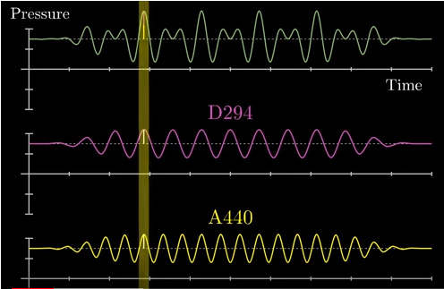

# 음성인식

## 소리

- [Wikipedia 소리의 정의](https://ko.wikipedia.org/wiki/소리) 참조

- 시간에 따른 기압의 분포(여러 개 주파수의 합이 신호의 세기로 나타남) : 일정한 시간을 주기로 측정한 기압의 차이

  

  $$F = \frac{1}{T} \ (F: Frequency, T: Time)$$

- 공기는 체적의 변화에 대해 복원력이 있으므로 파동을 전달하는 성질이 있다. 공기 속에서 물체가 진동하면 변화가 공기에 전달, 파동이 발생한다. 이것이 음파이다.

- 음파의 성질

  - **높낮이** : 소리의 높낮이는 진동수에 의해서만 결정되며 파장이랑 관련이 없다. 진동수가 높으면 높은 소리, 진동수가 낮으면 낮은 소리로 느낀다. 소리의 속도가 일정하다고 가정할 때, 파장은 진동수에 반비례한다. 인간이 들을 수 있는 진동수의 영역은 16에서 2만 Hz까지이다. 특히 진동수가 높은 소리와 낮은 소리는 들을 수 있는 범위가 좁다
  - **세기** : 소리의 세기는 그 파동이 얼마나 큰 압력을 갖고 있느냐로 계산되며, 음압이라고 표현되고 단위는 '데시벨'(dB)을 사용한다. 데시벨은 절대적인 기준 수치가 아닌 상대적인 값이며, 0dB를 기준으로 10dB가 증가할 때마다 그 소리의 세기, 즉 음압은 10의 거듭제곱 꼴로 커진다. 예를 들면 10dB는 0dB보다 10dB가 크므로 0dB보다 10¹배만큼 크다. 또한, 20dB는 0dB보다 20dB가 크므로 0dB보다 10²배, 즉 100배만큼 크다.
  - **전파 속도** : 음파의 속도(음속)는 직선 거리를 알고 있는 두 점 사이에서 전달되는 시간을 재면 구할 수 있다. 빛의 속도는 음속보다 훨씬 빠르기 때문에 한쪽 점에서 발사한 신호용 권총의 연기를 다른 한쪽에서 보고 소리가 들릴 때까지의 시간을 재면 된다. 또는 음파의 반사를 이용해서 재는 방법도 있다. 온도 15℃의 공기 속을 전파하는 음속은 대략 340m/s이다. 음속은 진동수나 기압에는 관계가 없고 공기의 온도에 의해서만 변한다. 음속이 공기의 온도에 의해 변하는 것은 공기의 밀도가 온도에 의해 변하기 때문이므로, 밀도가 작을수록, 혹은 온도가 높을수록 매질은 이동하기 쉬워져서 음속은 빨라진다. 보통 기체 속보다도 액체 속의 음속이 크며, 액체 속보다 고체 속이 크다.
  - **위상** : 진폭과 주파수가 같더라도 위상이 서로 다르면 서로 다른 소리이다. 진폭과 주파수와 위상이 같은 소리를 더하면 진폭은 두 배가 된다. 진폭과 주파수가 같지만 위상이 서로 반대인 사인파를 더하면 서로 상쇄된다. 그러나 특정 주파수의 위상의 차이는 청각으로 인지할 수 있는 차이를 불러오지는 않는다.
  - **음색** : 바이올린의 소리와 플룻의 소리를 구별할 수 있는 것은 소리를 이루는 파동의 모양이 다르기 때문이다. 자연계에는 순수하게 사인파로만 이루어진 소리는 없으며, 각자 음압이 다른 배음의 배치들이나 다른 주파수들의 소리의 합이 전체적인 음색을 결정하게 된다. 예를 들어 현악기의 경우엔 정수배에, 관악기의 경우엔 홀수배에 배음의 스펙트럼이 등차적으로 생겨나는 것을 볼 수 있다. 마찬가지로 사람의 목소리를 구분할 수 있는것도 고유의 스펙트럼을 가지고 있기 때문이다. 푸리에의 이론은 간단한 사인파의 합으로 자연계의 어떤 소리든지 구현할 수 있다는 이론으로, 서로 다른 파장의 모임은 새로운 음색을 결정한다.
  - 기타 : 음파의 반사, 음파의 굴절, 음파의 간섭

## 푸리에 변환(Fourier transform)

- 푸리에 변환(Fourier transform, FT)은 시간에 대한 함수(혹은 신호)를 그 함수를 구성하고 있는 주파수 성분으로 분해하는 작업이다.

    $${X(\xi)=\int _{-\infty }^{\infty } x(t)\ e^{-2\pi i\xi t} dt} (ξ : 모든 실수 범위)$$

  - 독립변수 t는 시간을 나타내고, 변환변수 ξ는 주파수를 나타낸다. ξ는 f로 표현하기도 한다.
  - 임의의 주파수 ξ에 대하여, X(ξ)는 x(t)와 $e^{−2πiξt}$ 의 내적을 의미한다. 내적의 의미 중 여기서 가장 두드러지게 볼 것은 “닮음”이다. 푸리에 변환 공식은 "임의의 주파수 ξ에 대하여, X(ξ)는 x(t)와 $e^{−2πiξt}$ 가 얼마나 닮았는지를 말해주려고 합니다." 라는 의미를 내포하고 있다.
